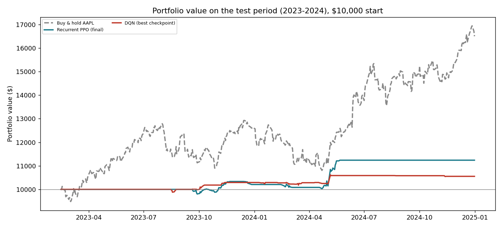

# Reinforcement Learning Agents for Stock Trading

Custom [Gymnasium](https://gymnasium.farama.org/) trading environments and several deep reinforcement
learning agents that learn to trade Apple (AAPL) stock from daily prices and technical indicators.
The agents are built with [Stable-Baselines3](https://stable-baselines3.readthedocs.io/) and
[SB3-Contrib](https://sb3-contrib.readthedocs.io/).

> **Status:** research / learning project, trained in May 2025. The trained agents, their TensorBoard logs
> and the exact train/test data are included, and their test results are reproduced below with
> `evaluate_saved_models.py`. **Headline:** the Recurrent PPO agent made **+12.4% with a Sharpe ratio of
> 1.21 and a 3.0% max drawdown** on 2023-2024, but **did not beat simply holding AAPL (+65%)**.

## Overview

```
yfinance ──► stock_analysis.py ──► train_data.csv / test_data.csv
                (indicators, scaling)         │
                                              ▼
                               trading_environments.py
                        (DiscreteTradingEnvironment: hold / buy / sell)
                        (ContinuousTradingEnvironment: action in [-1, 1])
                                              │
          ┌───────────────┬───────────────────┼────────────────────┐
          ▼               ▼                   ▼                    ▼
   Recurrent PPO      A2C + LSTM        DQN + LSTM features       SAC
   (discrete)         (discrete)        (discrete)            (continuous)
```

## Data

`stock_analysis.py` downloads AAPL daily data (2013 to 2025) with `yfinance`, fills missing values, scales
the features and adds technical indicators with `stockstats`: **MACD, RSI and Bollinger Bands**.
It then splits the data chronologically:

| Split | Period |
|---|---|
| Train | 2013-01-01 to 2022-12-31 |
| Test | 2023-01-01 onwards |

It also saves plots of price and volume, MACD, RSI and the Bollinger Bands to `plots/`.

## Trading environments

Both environments live in `trading_environments.py` and share a common abstract base class.

| | Discrete | Continuous |
|---|---|---|
| **Actions** | `0` hold, `1` buy, `2` sell (fixed trade size) | value in `[-1, 1]`: fraction of cash to invest (> 0) or of shares to sell (< 0) |
| **Observation** | last 30 days of prices, volume and indicators, plus cash balance and shares held | same |
| **Reward** | change in total portfolio value (cash + shares × price) at each step | same |
| **Costs** | 0.1% transaction cost on every trade | same |
| **Start** | $10,000 cash, no shares | same |

## Agents

| Script | Algorithm | Environment |
|---|---|---|
| `train_ppo_agent.py`, `ppotrading_final.py` | Recurrent PPO with an LSTM policy (SB3-Contrib) | discrete |
| `train_a2c_lstm_agent.py` | A2C with a custom LSTM feature extractor | discrete |
| `train_rainbow_dqn_agent.py` | DQN with an LSTM feature extractor | discrete |
| `Rainbow-DQN-version1.ipynb` | Rainbow-style DQN experiments (notebook) | discrete |
| `train_sac_agent.py` | Soft Actor-Critic | continuous |

Each script trains the agent, saves the model, then evaluates it on the test period and plots the
portfolio value. The PPO, DQN and SAC scripts normalise observations and rewards with `VecNormalize`.
`ppotrading_final.py` also reports **cumulative return, annualised Sharpe ratio, maximum drawdown and
volatility**, and plots the distribution of actions.

## Results on the test period (2023-2024)

All agents were trained on 2013-2022 and evaluated once, deterministically, on unseen data
(14 Feb 2023 to 31 Dec 2024, after the 30-day observation window), starting with $10,000.
Reproduce with `python evaluate_saved_models.py` (about 1 minute on CPU, no download needed).

| Strategy | Return | Sharpe (annualised) | Max drawdown | Volatility |
|---|---:|---:|---:|---:|
| Buy & hold AAPL (baseline) | **+65.0%** | **1.39** | 16.4% | 20.8% |
| Random policy (mean of 100 runs) | +22.3% | 0.91 | 13.2% | 12.3% |
| **Recurrent PPO (final model)** | **+12.4%** | **1.21** | **3.0%** | **5.3%** |
| DQN (best checkpoint)* | +5.5% | 1.04 | 1.2% | 2.8% |



**Reading the results**

- The PPO agent is **very defensive**: it stays in cash most of the time and holds at most about 60 shares
  (the environment trades 10 shares per action). This gives a **low drawdown (3% vs 16%) and a
  Sharpe ratio close to buy & hold**, but a much lower return.
- In a strongly rising market (AAPL +65% over the period), **no agent beats buy & hold**, and a random
  policy that is often invested does better than the agents on raw return. The environment's fixed
  10-share trade size and the reward (daily change in portfolio value) push the agents towards small,
  cautious positions.
- The **PPO result matches the evaluation made at training time** (portfolio ≈ $11,240, see
  [`results/ppo_evaluation_original_run.png`](results/ppo_evaluation_original_run.png)).
- **Instability:** results depend strongly on the checkpoint. The "best" PPO checkpoint selected on the
  training data never buys on the test set (0%), and in the Rainbow DQN notebook the evaluation profit
  ranges from -62% to +44% between checkpoints and ends at -16%.

\*The training scripts wrap the environment in `VecNormalize`, but its statistics were not saved with
these models. `evaluate_saved_models.py` therefore evaluates each model twice: on raw observations (as
`evaluate_model()` in the training scripts does) and with observations normalised by statistics
recomputed on the training data. The PPO row uses raw observations (the original evaluation); the DQN
row uses the recomputed normalisation, since on raw observations the DQN never buys. All rows, including
the action counts, are in [`results/test_metrics.csv`](results/test_metrics.csv). Models for the A2C and
SAC agents were not kept, so they are not evaluated here.

## Getting started

```bash
python -m venv .venv
source .venv/bin/activate          # Windows: .venv\Scripts\activate
pip install -r requirements.txt

python evaluate_saved_models.py    # reproduce the results table from the saved models

python stock_analysis.py           # 1. (optional) re-download data and rebuild train/test sets
python test_trading_env.py         # 2. sanity-check both environments with random actions
python train_ppo_agent.py          # 3. train and evaluate an agent (or any other train_*.py)
```

Training length is set in each script (10,000 to 100,000 timesteps). TensorBoard logs are written to
`logs/` (the logs of the original May 2025 runs are included):

```bash
tensorboard --logdir logs
```

## Repository structure

```
evaluate_saved_models.py   evaluates the saved agents against buy & hold and a random policy
train_data.csv, test_data.csv  AAPL daily data with indicators (2013-2022 / 2023-2024)
models/                    trained Recurrent PPO and DQN agents (final and best checkpoints)
logs/                      TensorBoard logs and evaluation log of the original training runs
results/                   test metrics and figures
stock_analysis.py          data download, indicators, train/test split
trading_environments.py    discrete and continuous Gymnasium environments
test_trading_env.py        random-action checks of both environments
train_ppo_agent.py         Recurrent PPO (LSTM)
ppotrading_final.py        Recurrent PPO, final training and evaluation run
train_a2c_lstm_agent.py    A2C with LSTM feature extractor
train_rainbow_dqn_agent.py DQN with LSTM feature extractor
train_sac_agent.py         SAC on the continuous environment
Rainbow-DQN-version1.ipynb Rainbow DQN notebook experiments
MyCoRL Approach.jpg        research notes on a branching-exploration idea (see below)
```

## Research notes: a branching-exploration idea

`MyCoRL Approach.jpg` sketches an idea explored alongside the standard agents: **active exploration by
branching**. From a market state, the agent explores several short branches of possible actions
(buy / sell / hold), and credit is assigned to each state-action pair from the discounted return of its
branch, normalised by the branch length. It is inspired by how organisms route nutrients towards the most
rewarding paths and adapt in real time.

## Limitations

- **Single asset, daily data.** One stock (AAPL) and one train/test split, so results do not generalise.
- **Does not beat buy & hold.** Over 2023-2024 the best agent returns +12% against +65% for holding AAPL.
- **Unstable evaluation.** Evaluation profit varies strongly between training checkpoints (see the
  results section and the notebook), so the agents are not ready for any real use.
- **Normalisation statistics not saved.** The `VecNormalize` statistics of the original runs were not
  saved, so the saved models are evaluated as described above.
- **Simplified market.** Orders fill at the closing price with a flat 0.1% cost. There is no slippage,
  no market impact and no short selling.

This project is for research and learning. It is **not financial advice**.

## Author

**Assim Ayoub**, [@A2A-o4](https://github.com/A2A-o4)
